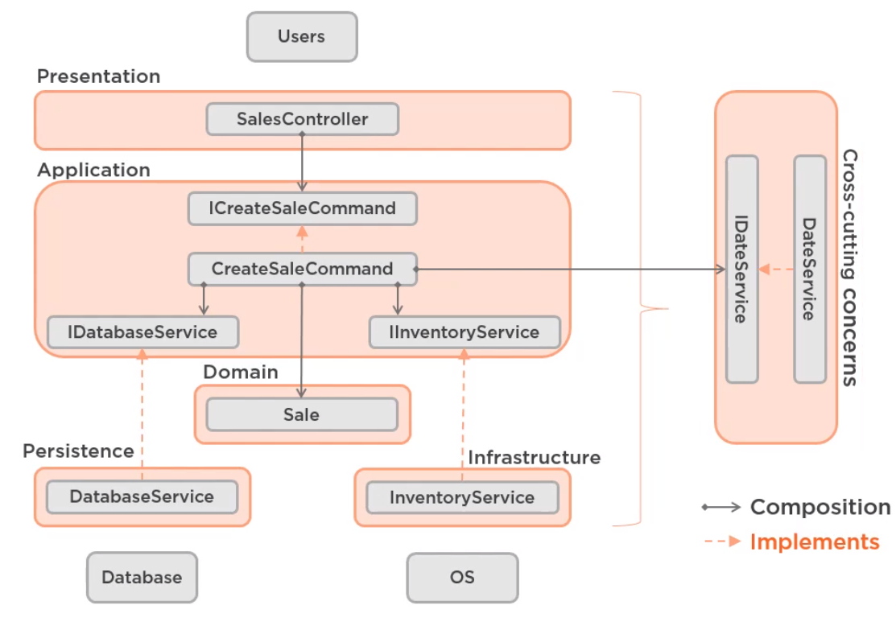

# SalesApp-Clean-Architecture-Spring-Kotlin
Repository destined to store the project developed in the course Clean Architecture: Patterns, Practices, and Principles (Pluralsight)

### Application's Model

- Customers(id, name)
- Employees(id, name)
- Products(id, name, price)
- Sales(id, date, unitPrice, quantity, totalPrice, idCustomer, idEmployee, idProduct)

## SalesApp Architecture
SaleApp-ArchDiagram.png
